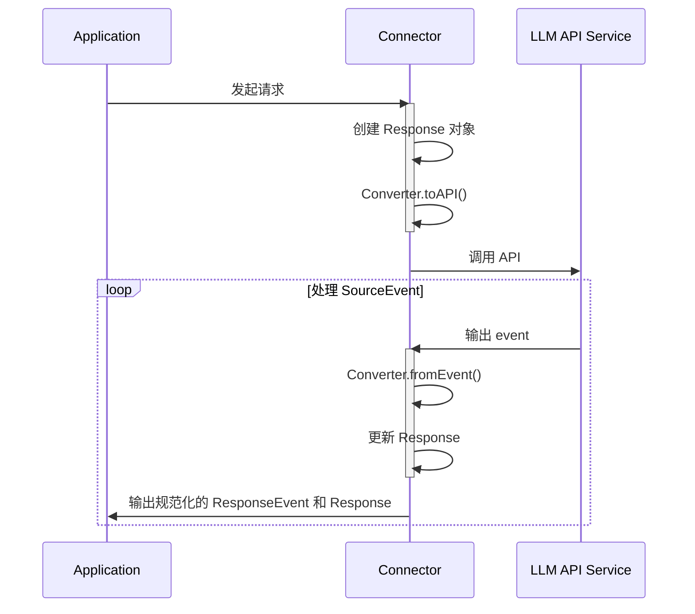

# NeuralLink

NeuralLink 是一个 LLM 客户端，用于连接各种大模型服务。

## 核心组件

NeuralLink 的核心组件由两部分组成：

1. `Connector` 负责连接到模型 API，发送请求以及接收响应。
2. `Converters` 定义了 Connector 和模型服务 API 之间的双向数据转换方法。

- Connector 通过 SSE 或 WebSocket 协议连接到模型 API 服务，向模型 API 发送请求，并接收模型 API 输出的 Event Stream 或监听 WebSocket 响应消息。
- Converter 是一组抽象的接口定义，Converter 包含两个抽象方法需要实现：
  - `Converter.toAPI()`：在 `Connector.call()` 方法中被调用，将传入的规范化模型参数转换为模型服务 API 可接受的参数。
  - `Converter.fromEvent()`：将从模型服务接收到的 SourceEvent 转换为 Connector 可处理的规范化事件对象 ResponseEvent。

## 处理流程

Connector 和 Converter 之间的调用流程如下：

## Schemas

- Connector 的 Schema 参考：[connector.md](connector.md)
- Converter 的 Schema 参考：[converter.md](converter.md)