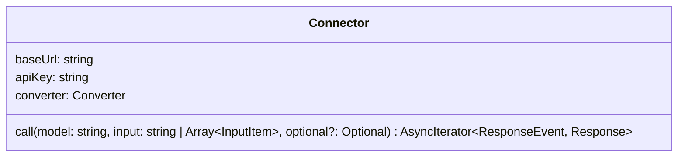

# Connector 

Connector 的定义如下：

## 属性：

| 属性 | 类型 | 是否必填 | 说明 |
| -- | -- | -- | -- |
| baseUrl | string | 必填 | 模型服务的连接地址，如：https://api.deepseek.com/v1/chat/completions |
| apiKey | string | 必填 | 模型服务所需的 API key |
| converter | Converter | 必填 | Connector 内部调用的 Converter 实现 |

## 方法

`call(model: string, input: string | Array<InputItem>, optional?: Optional): AsyncIterator<ResponseEvent, Response>` 

调用模型 API 服务并流式输出结果。注意：`ResponseEvent`是经过 Connector 内部逻辑处理过的事件对象，不等同于任何模型 API 服务返回的原始 Event。

**参数**

| 参数 | 类型 | 是否必填 | 说明 |
| -- | -- | -- | -- |
| model | string | 必填 | 模型 ID |
| input | string \| Array\<InputItem\> | 必填 | 调用模型时的输入 |
| optional | Optional | 非必填 | 调用模型时的可选参数 |

## 类型 

### InputItem

InputItem 是 Connector 接收的规范化的模型输入，可以是以下结构的任意一种：

- Message
- FunctionCall
- FunctionCallOutput
- CustomToolCall
- CustomToolCallOutput

`Optional`

模型 API 可选参数。

**属性：**

| 属性 | 类型 | 说明 |
| -- | -- | -- |
| instructions | string | 系统提示词 |
| tools | Array\<Tool\> | 工具定义列表 |

### Message

消息对象参数。

注意：

- `role="developer"` 或 `role="system"` 的消息必须在数组的最前。
- 当 `role="assistant"` 时，`content` 的类型只会为 `TextMessage`。

**属性：**

| 属性 | 类型 | 说明 |
| -- | -- | -- |
| role | enum("user", "assistant", "developer", "system") | 消息发起者的角色 |
| type | "message" | input 的类型，固定为 "message" |
| content | Array<TextMessage \| ImageMessage \| FileMessage> | 消息的类型 |

### FunctionCall

函数调用执行。

**属性：**

| 属性 | 类型 | 说明 |
| -- | -- | -- |
| type | "function_call" | input 的类型，固定为 "function_call" |
| call_id | string | 模型生成的函数调用执行的 ID |
| name | string | 模型选择的要执行的函数的名称 |
| arguments | string | 模型生成的函数执行参数，JSON 字符串格式 |

### FunctionCallOutput

函数调用结果。

**属性：**

| 属性 | 类型 | 说明 |
| -- | -- | -- |
| type | "function_call_output" | input 的类型，固定为 "function_call_output" |
| call_id | string | 模型生成的函数调用执行的 ID，用于关联函数调用执行和函数调用结果 |
| output | string | 函数执行的结果 |

### CustomToolCall

生成可执行代码。

**属性：**

| 属性 | 类型 | 说明 |
| -- | -- | -- |
| type | "custom_tool_call" | input 的类型，固定为 "custom_tool_call" |
| call_id | string | 模型生成的可执行代码的执行 ID |
| name | string | 模型选择的要执行代码的工具名称 |
| input | string | 模型生成的可执行代码 |

### CustomToolCallOutput

可执行代码的执行结果。

**属性：**

| 属性 | 类型 | 说明 |
| -- | -- | -- |
| type | "custom_tool_call_output" | input 的类型，固定为 "custom_tool_call_output" |
| call_id | string | 模型生成的可执行代码的执行 ID，用于关联代码执行和代码执行结果 |
| output | string | 代码的执行结果 |

### TextMessage

文本消息。

**属性：**

| 属性 | 类型 | 说明 |
| -- | -- | -- |
| type | "input_text" | 消息类型，固定为 "input_text" |
| text | string | 文本内容 |

### ImageMessage

图片消息。

**属性：**

| 属性 | 类型 | 说明 |
| -- | -- | -- |
| type | "input_image" | 消息类型，固定为 "input_image" |
| image_url | uri | 图片的 URI 地址 |

### FileMessage

文件消息。

**属性：**

| 属性 | 类型 | 说明 |
| -- | -- | -- |
| type | "input_file" | 消息类型，固定为 "input_file" |
| file_url | uri | 文件的 URI 地址 |

### Tool

Tool 表示工具的定义，可以是以下结构的一种：

- Function
- WebSearch

### Function

自定义函数。

| 属性 | 类型 | 说明 |
| -- | -- | -- |
| type | "function" | 工具类型，固定为 "function" |
| name | string | 函数名称 |
| description | string | 函数描述 |
| parameters | object | 函数参数，使用 JSON Schema 表示 |

### WebSearch

联网搜索工具。（暂不实现）

### Response

增量累积后的响应对象。参考：[response.md](response.md)