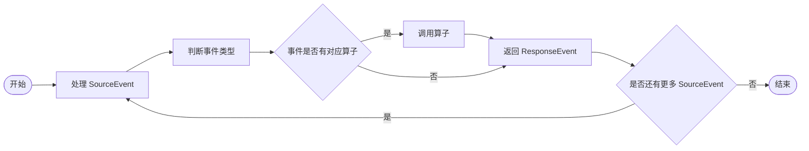

# ChatCompletionsConverter

ChatCompletionsConverter 负责在 Connector 和 Chat Completions 风格的接口之间进行请求/响应的转换。

## 概述

Chat Completions 的事件没有 type 标识不同的事件类型，因此需要根据 `choices[0]` 的**内容**来判断事件类型。根据不同的事件类型我们需要定义对应的处理算子，每个算子接收 SourceEvent 并返回规范化后的 ResponseEvent。

## 处理算子



如果事件类型没有对应的处理算子，则该事件类型暂不需要进行转换，打印原始的 SourceEvent 并跳过处理逻辑。

注意：算子只应该处理 SourceEvent 并返回 ResponseEvent，更新 ResponseEvent 的操作应该在 Connector 中进行。

以下处理算子根据 SourceEvent 的 `choices[0]` 对象来进行分类。注意：

- event 序列的第一条

SourceEvent 示例：

```json
{
    "choices": [
        {
            "delta": {
                "reasoning_content": "用户",
                "role": "assistant"
            },
            "index": 0
        }
    ],
    "created": 1784279490,
    "id": "021784279488422b686cf77507a74aa4905f351832e6617ebd482",
    "model": "doubao-seed-evolving-latest-version",
    "service_tier": "default",
    "object": "chat.completion.chunk",
    "usage": null
}
```

映射流程：

1. 如果是 event 序列的第一条，输出一次 ResponseCreated 事件，将 `id`、`created` 元数据映射到 ResponseCreated.id 和 ResponseCreated.created_at。
2. 对所有序列（包括第一条），都需要判断 ResponseResult.output 中是否已经存在 Reasoning 或 Message：
    - 如果 choices[0].delta.reasoning_content 存在且 Reasoning 存在，则映射为 ResponseReasoningSummaryTextDelta，否则映射为 ResponseReasoningSummaryPartAdded。
    - 如果 choices[0].delta.content 存在且 Message 存在，则映射为 ResponseContentPartAdded，否则映射为 ResponseOutputTextDelta。