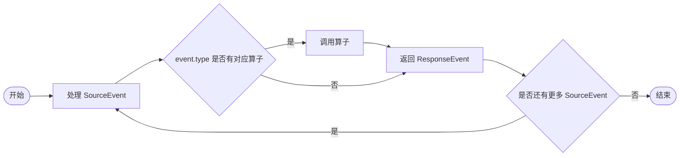

# ResponsesAPIConverter

ResponsesAPIConverter 负责在 Connector 和 Response API 风格的接口之间进行请求/响应的转换。

## 概述

Response API 的事件会返回 `type` 属性用来标识不同的事件类型。根据不同的事件类型我们需要定义对应的处理算子，每个算子接收 SourceEvent 并返回规范化后的 ResponseEvent。

- ResponseEvent 的定义参考：[response-event.md](response-event.md)
- Response API 风格接口参考： [OpenAI 官方文档](https://developers.openai.com/api/reference/resources/responses/index.md) 

## 处理算子

如果事件类型没有对应的处理算子，则该事件类型暂不需要进行转换，打印原始的 SourceEvent 并跳过处理逻辑。

注意：算子只应该处理 SourceEvent 并返回 ResponseEvent，更新 ResponseEvent 的操作应该在 Connector 中进行。

以下处理算子根据 SourceEvent 的 `type` 属性来进行分类。

`responses.created`

映射到 ResponseCreated 类型。

`response.output_item.added`

映射到 ResponseOutputItemAdded 类型。

`response.content_part.added`

映射到 ResponseContentPartAdded 类型。

`response.output_text.delta`

映射到 ResponseOutputTextDelta 类型。
