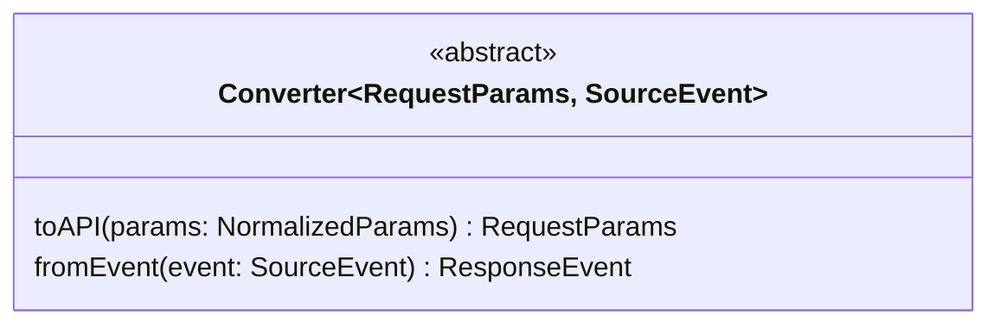

# Converter

Converter 是一个抽象接口，需要具体的类来实现，定义如下：

## 方法

`Converter.toAPI(params: NormalizedParams): RequestParams`

将输入到 Connector 的模型参数转换为不同模型服务 API 支持的参数。

**参数**

| 参数 | 类型 | 说明 |
| -- | -- | -- |
| params | NormalizedParams | 规范化的模型调用参数 |

`Converter.fromEvent(event: SourceEvent): ResponseEvent`

将从模型服务 API 接收到的 event 转换为规范化的 event 结构。

| 参数 | 类型 | 说明 |
| -- | -- | -- |
| event | SourceEvent | 从模型服务 API 接收到的 event |

## 类型 

`NormalizedParams`

从 Connector 传入的规范化的模型参数。

**属性：**

| 属性 | 类型 | 说明 |
| -- | -- | -- |
| model | string | 模型 ID |
| input | string \| Array<InputParam> | 调用模型时的输入 |
| instructions | string | 系统提示词 |

`RequestParams`

RequestParams 是一个泛型，描述模型服务 API 接受的转换后类型，需要在实现 Converter 时传入类型定义。

`SourceEvent`

SourceEvent 是一个泛型,描述从模型 API 服务返回的 event 事件。需要在实现 Converter 时传入类型定义。

`ResponseEvent`

ResponseEvent 是规范化的事件对象类型，Schema 参考：[ResponseEvent](response-event.md)

## 预置 Converter

NeuralLink 提供了三个预置的 Converter：

- ChatCompletionsConverter，参考：[converter-chat-completions.md](converter-chat-completions.md)
- ResponsesAPIConverter，参考：[converter-responses-api.md](converter-responses-api.md)
- AnthropicConverter，参考：[converter-anthropic.md](converter-anthropic.md)